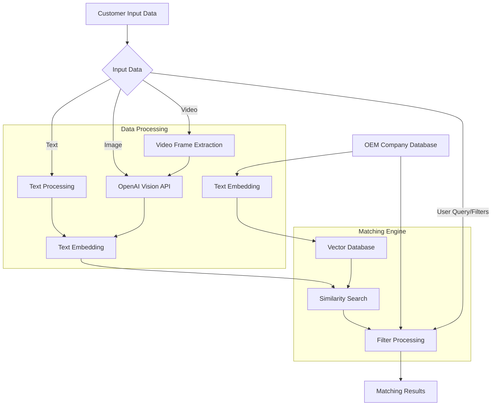

```mermaid
graph TD
    A[Customer Input Data] --> B{Input Data}
    B -->|Text| C[Text Processing]
    B -->|Image| D[OpenAI Vision API]
    B -->|Video| E[Video Frame Extraction]
    B -->|User Query/Filters| F[Filter Processing]
    E --> D
    C --> G[Text Embedding]
    D --> G
    G --> H[Similarity Search]
    H --> F
    I --> F

    I[OEM Company Database] --> J[Text Embedding]
    J --> K[Vector Database]
    K --> H
 
    F --> L[Matching Results]


    subgraph "Data Processing"
    C
    D
    E
    G
    J
    end

    subgraph "Matching Engine"
    K
    H
    F
    end
```